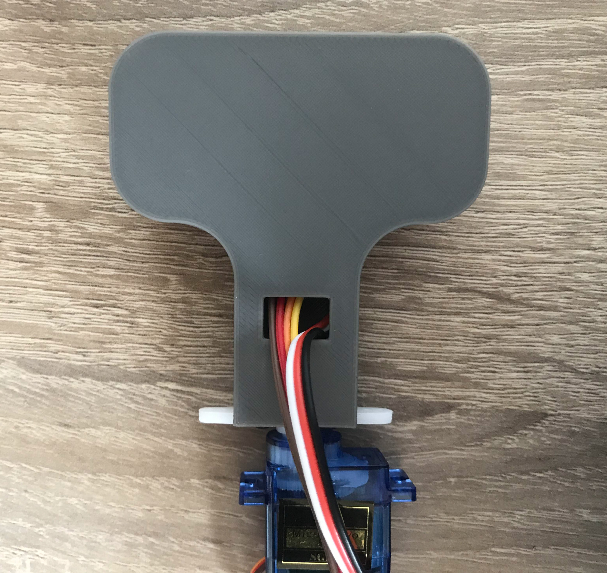

# Ultrasonic Sensor Housing

## Things you'll need:

* [Ultrasonic Sensor](https://aliexpress.com/item/1005001621997017.html)
* [Servomotor with levers](https://aliexpress.com/item/32898059654.html)
* [Led strip](https://aliexpress.com/item/4000148759042.html)
* 16 grams of pla filament

## Steps to assemble the housing:

### Step 1:
* Download and print [these](./Parts/Parts_STL) parts on your 3d printer.
  
### Step 2:
* After printing, attach the servo to the bracket:

### Step 3:
* Next, attach the bracket to the sensor:

### Step 4:
* Next, push the mount onto the sensor and don't be afraid to apply a little pressure:

### Step 5:
* Then we take the ultrasonic sensor:

### Step 6:
* And attach the crimp cables to it:

### Step 7:
* The next step is to insert the ultrasonic sensor into the sensor section of the housing:

### Step 8:
* The last major step is to put the led strips on the cover:

### Step 9:
* And now we cover everything with the lid and we're done:

