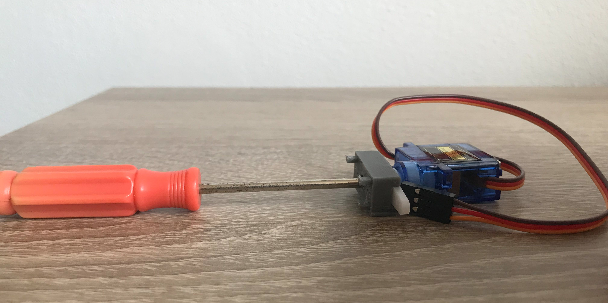

# Ultrasonic Sensor Housing

## Things you'll need:

* [Ultrasonic Sensor](https://www.mall.cz/hracky-rozvoj-aktivita/ostatni-hy-srf05-ultrazvukovy-senzor-100111860112?utm_source=google_organic_shopping&utm_medium=organic)
* [Servomotor with levers](https://dratek.cz/arduino/897-eses-servo-motor-9g.html?gclid=Cj0KCQjw7PCjBhDwARIsANo7CgnI6uDLzxxIQLcyTPE7dsFn0WTo0lLdOpigC8M7lxas-uX0V5HISoEaAs1nEALw_wcB)
* [Led strip](https://www.digitalni-led.cz/product/digitalni-adresovatelne-led-pasky-ws2811/ws2812b-5v/led-pasek-digitalni-ws2812b_-5v_-30led_m/99)
* 16 grams of pla filament

## Steps to assemble the housing:

### Step 1:
* Download and print [these](./US_Cover_STL) parts on your 3d printer.
  
### Step 2:
* After printing, attach the servo to the bracket:

### Step 3:
* Next, attach the bracket to the sensor:

### Step 4:
* Next, push the mount onto the sensor and don't be afraid to apply a little pressure:

### Step 5:
* Then we take the [ultrasonic sensor](https://www.mall.cz/hracky-rozvoj-aktivita/ostatni-hy-srf05-ultrazvukovy-senzor-100111860112?):

### Step 6:
* And attach the crimp cables to it:

### Step 7:
* The next step is to insert the ultrasonic sensor into the sensor section of the housing:

### Step 8:
* The last major step is to put the led strips on the cover:

### Step 9:
* And now we cover everything with the lid and we're done:

