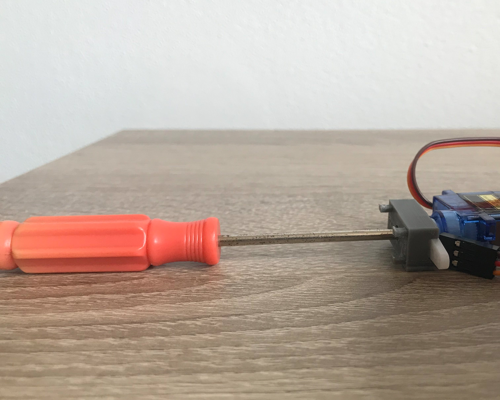
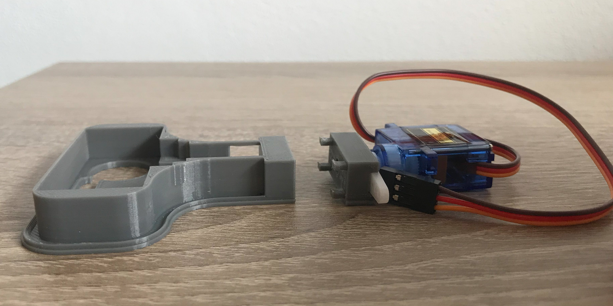
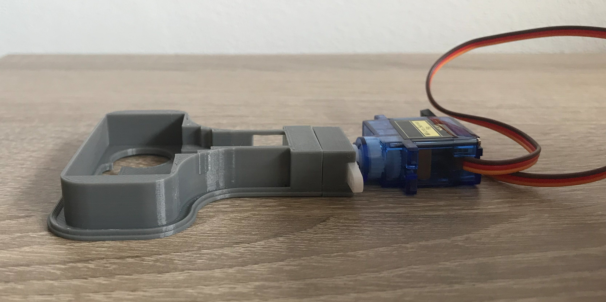
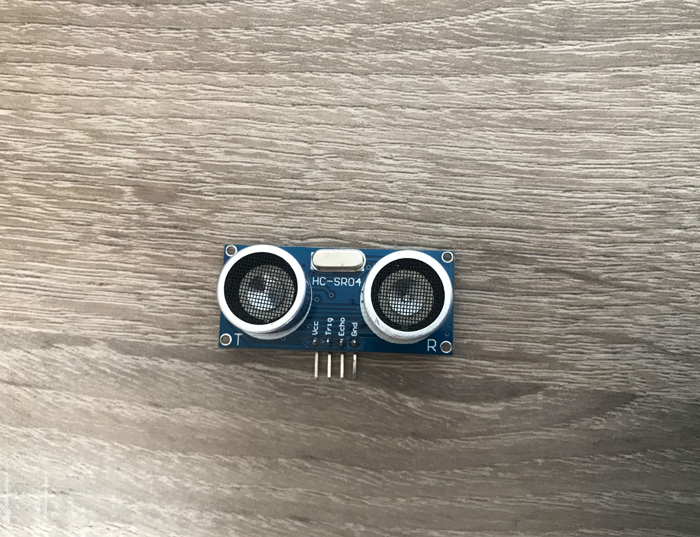
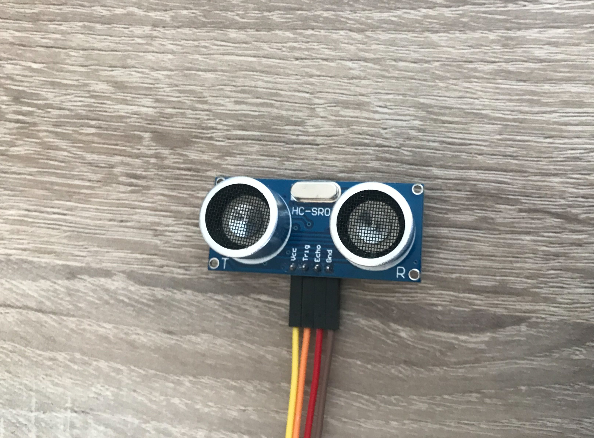
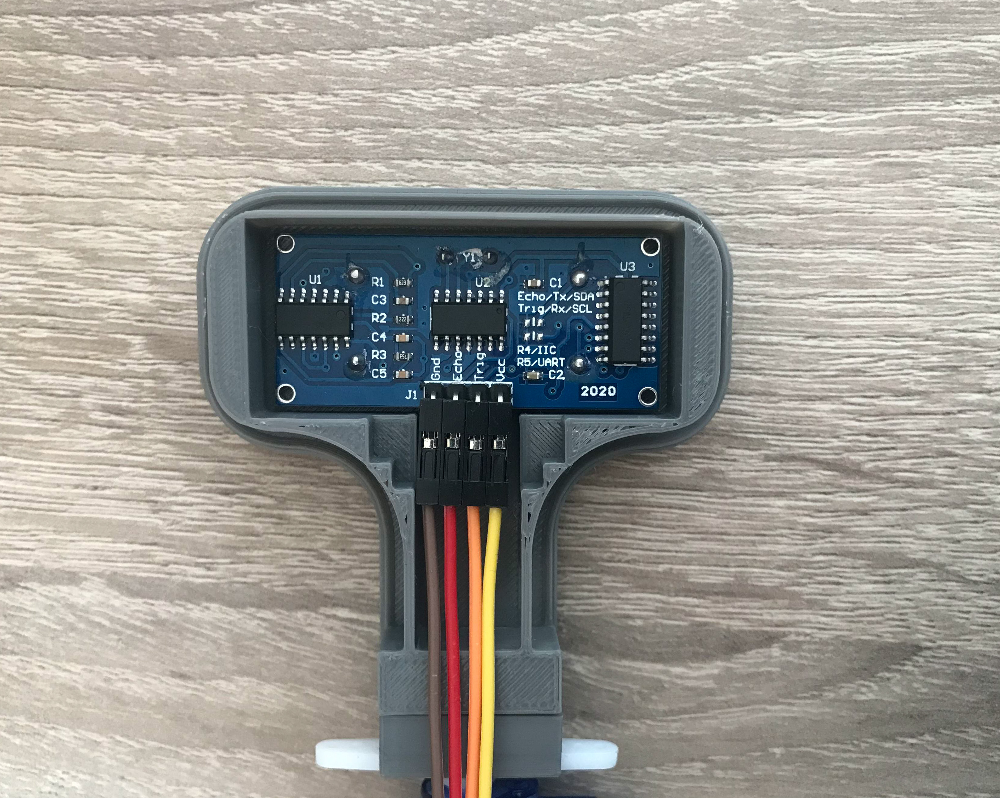
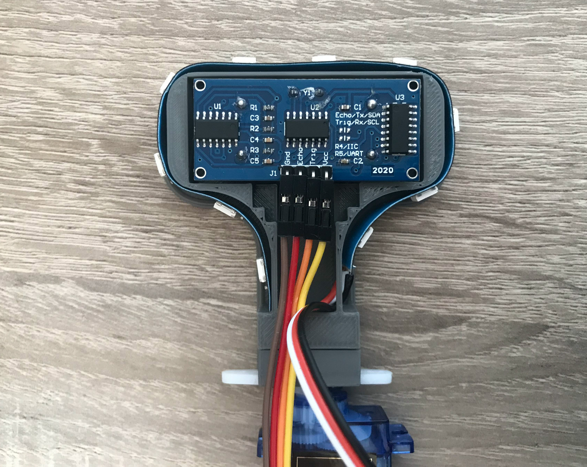
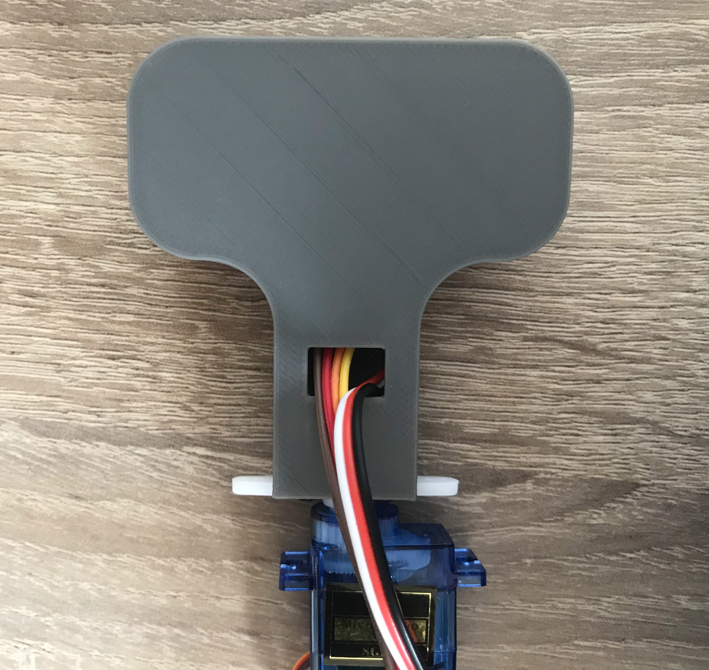

# Pouzdro na Ultrasonický senzor

## Věci, které budete potřebovat:

* [Ultrasonický senzor](https://www.mall.cz/hracky-rozvoj-aktivita/ostatni-hy-srf05-ultrazvukovy-senzor-100111860112?utm_source=google_organic_shopping&utm_medium=organic)
* [Serovmotor s pákami](https://dratek.cz/arduino/897-eses-servo-motor-9g.html?gclid=Cj0KCQjw7PCjBhDwARIsANo7CgnI6uDLzxxIQLcyTPE7dsFn0WTo0lLdOpigC8M7lxas-uX0V5HISoEaAs1nEALw_wcB)
* [Led pásek](https://www.digitalni-led.cz/product/digitalni-adresovatelne-led-pasky-ws2811/ws2812b-5v/led-pasek-digitalni-ws2812b_-5v_-30led_m/99)
* 16 gramů pla filamentu

## Kroky na složení pouzdra:

### Krok 1:
* Stáhněte a vytiskněte si na 3d tiskárně [tyto](./US_Kryt_STL) části.
  
### Krok 2:
* Po vytisknutí připentěte servo k držáku:

### Krok 3:
* Dále připevněte držák k senzoru:

### Krok 4:
* Následně zatlačte držák na sensor a nebojte se trochu přitlačit:

### Krok 5:
* Poté vezmeme [ultrasonický senzor](https://www.mall.cz/hracky-rozvoj-aktivita/ostatni-hy-srf05-ultrazvukovy-senzor-100111860112?):

### Krok 6:
* A na připojíme na něj krimpovací kabely:

### Krok 7:
* Dalším krokem vložíme ultrasonický senzor do senzorové části krytu:

### Krok 8:
* Posledním větším krokem je na nasadit led pásky na kryt:

### Krok 9:
* A teď vše zakryjeme víčkem a máme hotovo:

